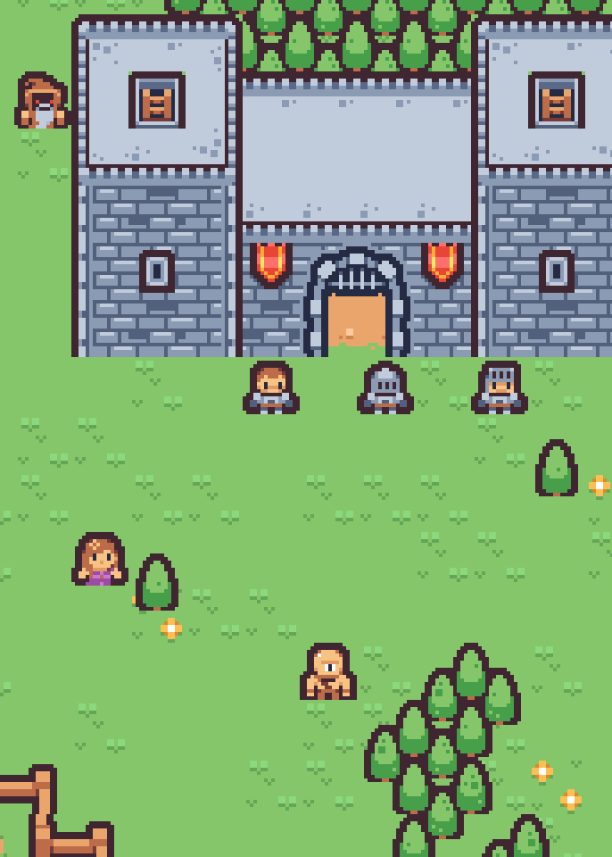

# FruitScape

FruitScape was my submission for the React Jam Winter 2023. It uses React-Pixi and the Rune SDK for multiplayer functionality.

## Attributions

### Music by controllerhead

https://opengameart.org/content/magic-town

[Creative Commons CC0](https://creativecommons.org/publicdomain/zero/1.0/)

### Sound effects and images by Kenney.nl

https://www.kenney.nl/assets

[Creative Commons CC0](https://creativecommons.org/publicdomain/zero/1.0/)

### Fruit Images by Admurin

https://admurin.itch.io/

https://opengameart.org/content/admurins-fruits

[Creative Commons BY-SA 4.0](https://creativecommons.org/licenses/by-sa/4.0/)
